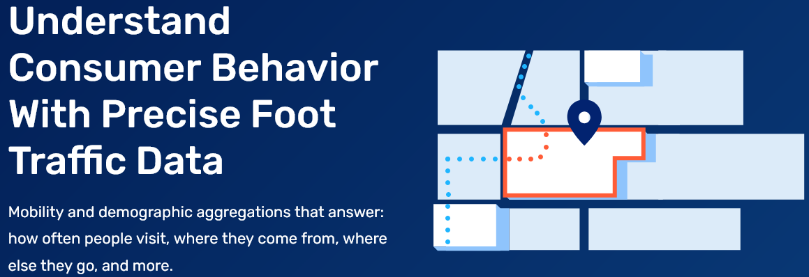
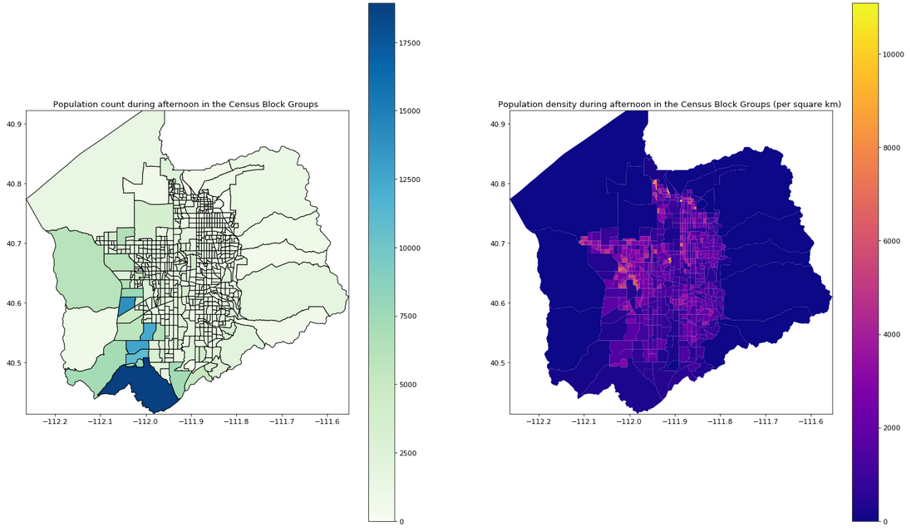

# Salt Lake County Mobility Patterns

This work will focus on capturing the urban mobility patterns, resulting in the so-called origin/destination matrices (O/D). The methods were applied on a free sample dataset from the foot traffic tracking company SafeGraph. As the company only performs such studies on American citizens, Salt Lake County was preferred due to its moderate population of approximately 1 million residents and its dynamic movement patterns. 

SafeGraph dataset: https://www.safegraph.com/products/patterns

The proportion of residents moving from one census block to another was done by dividing the number of mobile devices in the sample by the total number of devices in each census block group. As the preprocessing step was finished, five origin/destinationO/D matrices were produced from the original SafeGraph dataset, one for each
investigated time interval:

| Pattern Name  | Time Window |
| :-----------: | :---------: |
| Breakfast     | 6:00-10:59  |
| Lunch         | 11:00-14:59 |
| Afternoon Tea | 15:00-16:59 |
| Dinner        | 17:00-20:59 |
| Nightlife     | 21:00-24:00 |

As SafeGraph data only contains a sample of the actual population, the resulting proportion was multiplied with the population counts from the U.S. Census 2010 to get estimates on the implied flow of people moving from one Census Block Group to another at some time step interval.

|    area   | 490351001001 | 490351001002 | 490351001003 |
| :----------: | :----------: | :----------: | :----------: |
| 490351001001 | 63\.757      | 9\.285       | 3\.776       |
| 490351001002 | 12\.74       | 292\.11      | 1\.54        |
| 490351001003 | 55\.57       | 2\.54        | 546\.56      |

##  Using the described methods to get estimates on the population and population density in each Census Block Group during 15:00 and 16:59
---

